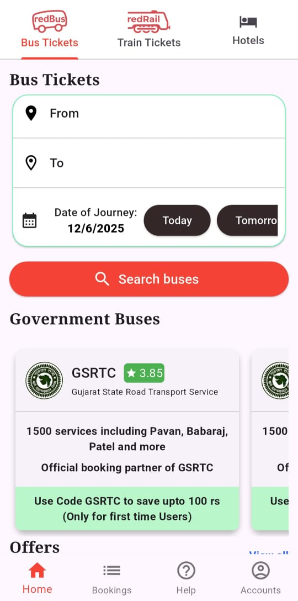
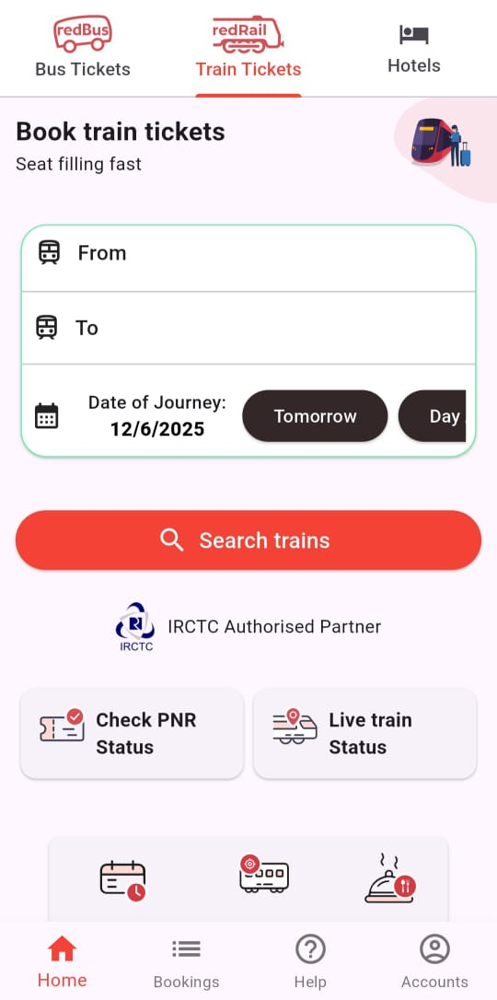
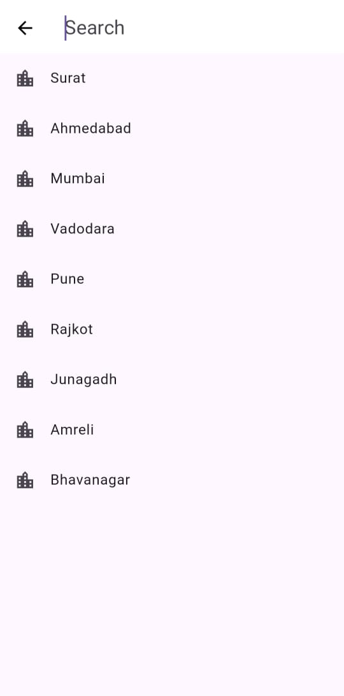

# 🚌 RedBus Clone - Flutter App (Educational Project)

A clone of the RedBus app built using **Flutter**, aimed at learning mobile UI design, state management, and navigation in a real-world app layout.

> ⚠️ **Note:** This project is developed **purely for educational purposes** and is not affiliated with RedBus or its parent company.

---

## 📸 Screenshots

| Bus Screen | Train  | Search Page |
|-------------|-------------|--------------|
|  |  |  |


## 📱 Features

- Modern and clean RedBus-style UI
- Source & destination city selection
- Date picker for travel date
- Bus search button (UI only)
- Custom reusable widgets
- Basic state management
- Navigation between pages
---

## 🛠️ Tech Stack

- **Flutter** (UI framework)
- **Dart** (programming language)
- Flutter Widgets like:
  - `TextFormField`, `DropdownButton`, `DatePicker`, `ListView`, `Card`, etc.
- `Provider` or `setState()` (depending on your implementation)
- `Material Design` components

---

## 🚀 Getting Started

### Prerequisites

- Flutter SDK installed
- Android Studio / VS Code with Flutter extensions
- A connected device or emulator

### Installation

```bash
git clone https://github.com/divyeshlathiya/redbus_clone.git
cd redbus_clone
flutter pub get
flutter run
